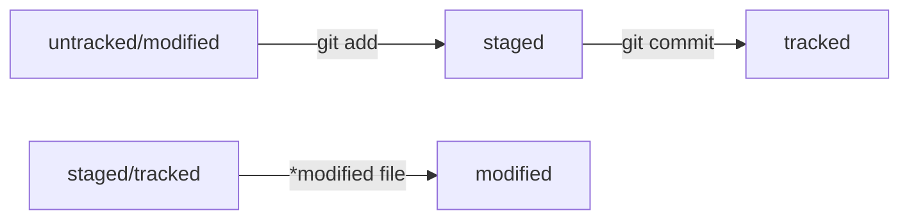

# Git & Bash Guide

## Управление директориям

**cd** перемещение к необходимой директории

**pwd** текущая директория

**~** домашняя

**ls -a** скрытые файлы

**touch** новый файл

**mkdir** создание директории

```
mkdir -p dir1/dir-inside/dir-deeper-inside # -p структура директории
```

*# создали папку dir-deeper-inside в папке dir-inside, которая находится в папке dir1*

**mkdir ~/my-git-projects** создание директории в домашней папке

**touch ../../file.txt** создание файла на 2 уровня выше

**cp index.html src/** что копируем и куда

**cp index.html style.css script.js src/** можно много файлов копировать

**cat** чтение файла (текстовые)

**rm example.txt** удаление файла

**rmdir images** удаление директории (без параметра удаляет только пустые папки)

**rm -r images** (-r удаляет с содержимым) **рекурсивно** удаляет файлы и папки

**&&** несколько команд сразу

**mkdir second-project && cd second-project && touch index.html style.css**

## Работа с локальным Git

```
git config --global [user.name](http://user.name/) "Tarasov Alexander"

git config --global user.email [aleksandrtarasov53@gmail.com](mailto:aleksandrtarasov53@gmail.com)
```

[Шпаргалка. Базовые команды в консоли](https://practicum.yandex.ru/trainer/git-basics/lesson/fe0bcd71-f592-423b-bb81-27c37a6a115b/)

## Работа с удалённым репозиторием в GitHub

```
git init
git status
git add .
git commit -m “”
git log
```

[Генерация SSH ключа](https://practicum.yandex.ru/trainer/git-basics/lesson/42435683-0922-4231-bfb4-d7d32d61f50a/)

```
git remote add origin git@github.com:tar-alexander/Training-C.git
git branch -M main
git push -u origin main
```

[Гайд по README.md](https://practicum.yandex.ru/trainer/git-basics/lesson/c6b9607c-e8bc-4446-89f9-c74522c3492f/)

## Хеш

Хеш — основной идентификатор коммита. У каждого коммита есть свой уникальный хеш, к которому можно обратиться. Чтобы, например, откатиться к нему назад. Также есть укороченная версия хеша, котрая используется в *git log --oneline*

## Лог

После вызова git log появляется список коммитов. Каждый лог состоит из 4 элементов:

1) хеш
2) Author
3) Date
4) Сообщение коммита

Пример лога:

```
commit e83c5163316f89bfbde7d9ab23ca2e25604af290
Author: Linus Torvalds <torvalds@linux-foundation.org>
Date:   Thu Apr 7 15:13:13 2005 -0700

    Initial revision of "git", the information manager from hell
```
Есть сокращенный вариант лога, который можно вызвать с помощью: *git log --oneline*

## HEAD

HEAD служебный файл, который можно найти в папке .git. В нём указана ссылка на последний и текущий коммит. 

Если взглянуть на содержимое файла HEAD, там можно найти ссылку на служебный файл refs/heads/master. Если заглянуть в этот файл, можно увидеть хеш последнего коммита.

Когда вы делаете коммит, Git обновляет refs/heads/master — записывает в него хеш последнего коммита. Получается, что HEAD тоже обновляется, так как ссылается на refs/heads/master.

Соответствующий указатель *(HEAD -> master)* отображается при вызове git log рядом с последним коммитом

## Статусы файлов в Git

У файлов в Git есть разные статусы: untracked/tracked, staged и modified.

* untracked (неотслеживаемый)

Когда файл не отслеживается Git. Git «видит», что такой файл существует, но не следит за изменениями в нём. У untracked-файла нет предыдущих версий, зафиксированных в коммитах или через команду git add.

* staged (подготовленный)

Файл попадает в *staging area* после вызова команды *git add*. Это список файлов, которые войдут в коммит

* tracked (отслеживаемый)

Противоположность *untracked*. В это состояние попадают файлы, которые уже были зафиксированы git commit, а также файлы, которые были добавлены в staging area командой git add. То есть все файлы, в которых Git так или иначе отслеживает изменения.

* modified (изменённый)

Состояние modified означает, что Git сравнил содержимое файла с последней сохранённой версией и нашёл отличия. Например, файл был закоммичен и после этого изменён.


